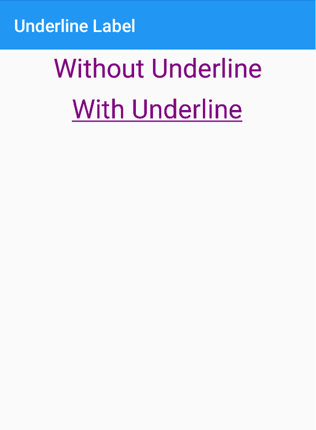

# xamarin-underline-label
Create underlined label in xamarin forms. We have designed Underlined Label using custom renderer.

# Create custom control for Label
Create new class called Label (You can give any name to this class), and inherit from Xamarin.Forms.Label. By inheriting this you can access or set all properties of Label to the created class.
This is also usefull to create all label from this, and whenever you have to change any property for all label you can chage directly from class once and it will work for all label used in project.

    public class Label : Xamarin.Forms.Label
    {
        public Label()
        {
            FontSize = 30;
            TextColor = Color.Purple;
        }
    }
   
Now, for add underline in label we have to create bindable property, this will help to add underline by setting property from design.

    public static readonly BindableProperty IsUnderlinedProperty = 
                                  BindableProperty.Create("IsUnderlined", typeof(bool), typeof(Label), false);

    public bool IsUnderlined
    {
       get { return (bool)GetValue(IsUnderlinedProperty); }
       set { SetValue(IsUnderlinedProperty, value); }
    }
    
# Add Custom LabelRendere class in Android & iOS Project
In this class, we will add logic for draw underline in label. We can also do many tasks frim this custom renderer. We can also create saperate for other tasks.

    if(Control!=null)
    {
        if (((UnderlinedLabel.Controls.Label)Element).IsUnderlined) 
        {
            Control.PaintFlags = PaintFlags.UnderlineText; // This will add underline to the label
        }
    }
  
  Same as above, we can also add custom LabelRenderer file in iOS project also.
  
    if(Control!=null)
    {
        if (((UnderlinedLabel.Controls.Label)Element).IsUnderlined)
        {
           var extendedElement = (UnderlinedLabel.Controls.Label)Element;
           Control.AttributedText = new NSMutableAttributedString(extendedElement.Text, Control.Font, underlineStyle: NSUnderlineStyle.Single);
        }
    }
 
